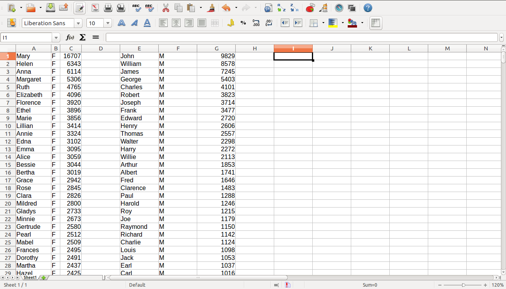

# Anteil der 10 häufigsten Vornamen berechnen

## Ziele

* ein großes Tabellendokument navigieren
* Bereiche auswählen und verschieben
* eine Summe berechnen
* einen prozentualen Anteil berechnen

## Aufgaben

Wir möchten wissen, ob die in den USA verwendeten Namen in den letzten 100 Jahren mehr oder weniger abwechslungsreich geworden sind. Dazu berechnen wir, welchen Anteil die 10 häufigsten Babynamen an den Geburten in den Jahren 1900 und 2000 haben.

#### Check

*Du solltest an dieser Stelle eine Datei mit Babynamen in Deine Tabellenkalkulation geladen haben. Die Tabelle sollte drei Spalten haben (*Name, Geschlecht, Anzahl*).

### 1. Navigieren der Tabelle

Fahre in der Tabelle zum Ende. Wähle dazu eine belegte Zelle aus und drücke **Strg + Pfeil-unten**. Fahre mit **Strg + Pfeil-oben** wieder hoch.

Finde nun die Stelle, an der die Mädchennamen (F) aufhören und die Jungennamen beginnen. 

#### Möglichkeit A: Navigationstasten
Verwende dazu die **Scrolleiste** an der Seite, die Tasten *Bild auf / Bild ab* und das Mausrad?

#### Möglichkeit B: Suchen
Fahre in der Tabelle ganz nach oben. Suche mit **Strg + F** einen Jungennamen, von dem Du glaubst, daß er ganz weit oben in der Liste steht.

#### Fragen

* In welcher Zeile ist der letzte Mädchenname?
* Welche der beiden Möglicheiten ist schneller?

### 2. Bereiche auswählen und verschieben

Wir möchten die Mädchen- und Jungennamen zum besseren Vergleich nebeneinander stellen. Dazu markieren wir den gesamten Bereich mit Jungennamen, schneiden ihn aus und füge ihn als Spalte E-G wieder ein. Im einzelnen:

#### 2.1 Bereiche auswählen

Einige tausend Zeilen mit der Maus zu markieren ist etwas beschwerlich. Wähle stattdessen die erste Zelle mit einem Jungennamen an. Verwende dann **Umschalten + Pfeile** um einen Bereich zu markieren. Mit **Umschalten + Bild auf/ab** und **Umschalten + Strg + Pfeil** kannst Du schnell sehr große Bereiche markieren.

#### 2.2 Ausschneiden und einfügen

Schneide alle drei Spalten zu Jungennamen mit **Editieren -> Ausschneiden** oder **Strg + x** aus. Fahre ganz nach oben und wähle die Zelle **E1** an. Drücke **Editieren -> Einfügen** oder **Strg + v**, um die Daten dort einzufügen. 

#### Frage

Gibt es mehr verschiedene Jungen- oder Mädchennamen?

### 3. Gesamte Geburten von Mädchen und Jungen berechnen

Fahre in **Spalte C** ganz nach unten. Gehe in die erste leere Zeile und schreibe dort:

    =SUMME(C1:C333)

oder in einem englischsprachigen System:

    =SUM(C1:C333)

Drücke die Eingabetaste. Wenn Du ein *####* siehst, verbreitere die Spalte im Tabellenkopf durch Ziehen mit der Maus (alternativ: *Rechtsklick auf C -> Optimale Spaltenbreite*).

Setze nun für *333* die Nummer der letzten Zeile mit Daten ein.

#### Frage

Wie viele Mädchen und Jungen wurden im jeweiligen Jahr geboren?

### 4. Prozentualen Anteil berechnen

Wir möchten nun in Spalte berechnen, welchen Prozentanteil die beliebtesten Namen an den Geburten einnehmen. Notiere Dir dazu die Zeile mit der soeben berechneten Summe (*auf Papier*).

Fahre wieder nach oben. Trage in Zelle D1 ein:

    =C1/C$333

Ersetze die *333* durch die notierte Zeile mit der Summe. Verbreitere wieder die Spalte falls nötig. Oben in der Symbolleiste solltest Du einen Knopf **%** finden. Diesen bitte drücken. In der Nähe sind zwei weitere Knöpfe, mit denen Du mehr oder weniger Nachkommastellen anzeigen kannst. Finde eine Einstellung, die Du übersichtlich findest.

#### Frage

Welcher Prozentanteil fällt auf den häufigsten Namen?

### 5. Prozentualer Anteil für eine ganze Spalte

Markiere die Zelle D1 mit der Prozentformel. Kopiere diese über **Editieren -> Kopieren** oder **Strg + c**.

Markiere nun die gesamte Spalte D bis zum letzten Namen (z.B. nach unten fahren und dann mit **Umschalten + Strg + Pfeil hoch** markieren). Füge nun mit **Editiren -> Einfügen** oder **Strg + v** ein.

#### Hinweis

Wenn Du das Gefühl hast, daß etwas gewaltig schief gegangen ist, probiere die Änderung mit **Strg + z* rückgängig zu machen.

#### Fragen

* Inspizire die Formel in den Zellen D2, D3 usw. Was genau ist beim Kopieren passiert? 
* Was macht das Dollarzeichen ($)?
* Wie könntest Du prüfen, ob die Prozentberechnung korrekt ist, also insgesamt 100% ergibt?

### 6. Vergleich zwischen Jungen und Mädchen?

Wiederhole die Schritte 3 bis 5 für die Jungennamen in den Spalten E-G.

#### Frage
* Gibt es einen Unterschied zwischen Mädchen und Jungen?

### 7. Vergleich zwischen 1900 und 2000

#### Frage

* Vergleiche den Prozentanteil der häufigsten Namen im Jahr 1900 und 2000. Sind die Babynamen in dieser Hinsicht abwechslungsreicher geworden?

### 8. Anteil der 10 häufigsten Namen

Berechne die Summe der Prozentanteile für die häufigsten 10 Namen.

### 9. Anteil an der Gesamtbevölkerung

Berechne den prozentualen Anteil an den gesamten Geburten (Mädchen + Jungen)

### 10. Diagramm

Stelle die Prozentanteile der beliebtesten 10 Jungen- und Mädchennamen als Balkendiagramm dar.

### 11. Diskussion

Was für Stärken und Schwächen hat diese Beschreibung der Verschiedenheit von Namen? 