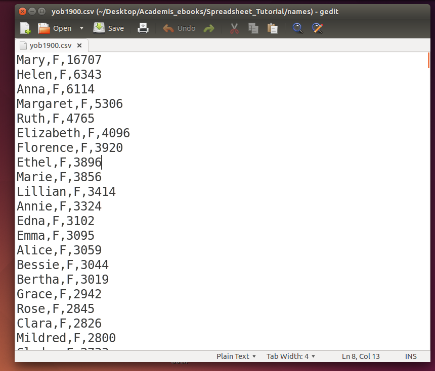
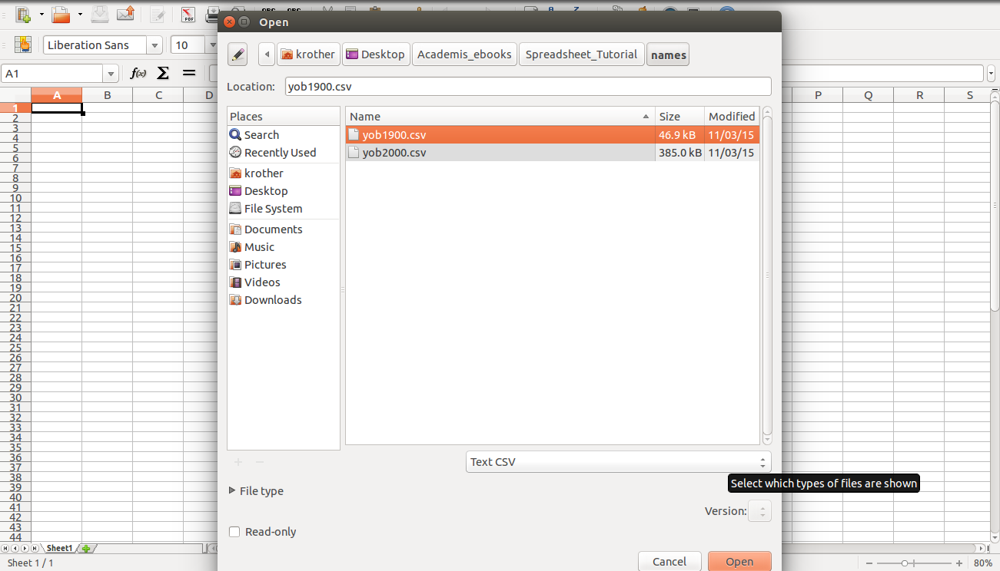
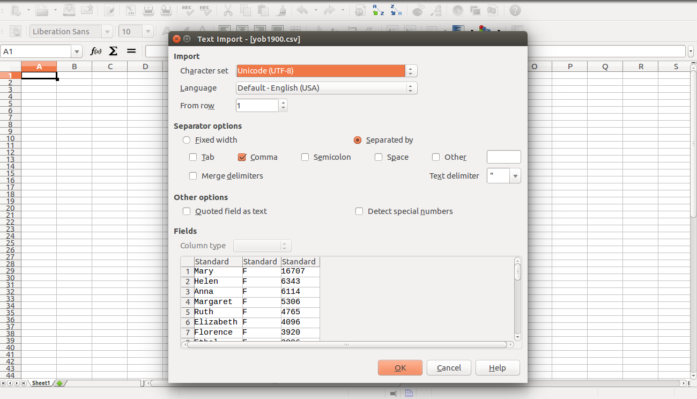

# Einen Datensatz von US-Babynamen laden

## Ziele

* eine Tabellenkalkulation starten
* eine Tabelle mit Babynamen laden
* das Textformat CSV kennen lernen

## Aufgaben

Der Einfachheit halber werden wir für die folgenden Übungen nur zwei der 134 verfügbaren Datensätze betrachten, nämlich die Jahre **1900 und 2014**.

### 1. Speichere die Dateien mit Babynamen auf Deinem Computer

Du kannst die Dateien von [http://www.ssa.gov/oact/babynames/limits.html](http://www.ssa.gov/oact/babynames/limits.html) selbst herunterladen. Uns interessiert die allgemeine Statistik, nicht die nach Bundesstaaten gegliederte. Du solltest eine ZIP-Datei von 6 MB Größe erhalten. Entpacke die ZIP-Datei. Es sollte ein neuer Ordner entstehen.

    yob1880.txt  yob1900.txt  yob1920.txt  yob1940.txt  yob1960.txt  yob1980.txt  yob2000.txt
    yob1881.txt  yob1901.txt  yob1921.txt  yob1941.txt  yob1961.txt  yob1981.txt  yob2001.txt
    yob1882.txt  yob1902.txt  yob1922.txt  yob1942.txt  yob1962.txt  yob1982.txt  yob2002.txt
    ...

#### Frage

* Wie viele Dateien befinden sich im Ordner *names*?

### 2. Umbenennen von Dateien

Für manche Tabellenkalkulationen ist die Endung des Dateinamens wichtig, damit das Format richtig erkannt wird. Um die Dateinamen zu sehen, mußt Du unter Windows eventuell unter *Ordneroptionen* die Endungen einblenden.

Ändere die Endung von zwei Dateinamen (1900, 2000) von **TXT** nach **CSV**. 

### 3. Das Datenformat inspizieren

Die Dateien befinden sich im Format CSV (comma separated values).
Öffne eine der CSV-Dateien im Texteditor (unter Windows z.B. Notepad oder Wordpad).

#### Fragen

* Gibt es einen Unterschied zwischen dem Inhalt der TXT- und CSV-Dateien?
* Was für Daten befinden sich in jeder Zeile?
* Wie sind die Spalten voneinander abgegrenzt?
* Mit was für Daten wäre das CSV-Format schwierig zu verwenden? 

### 4. Eine Tabellenkalkulation starten

Starte eine beliebige Tabellenkalkulation. Vergleiche die Programme aus der Tabelle.

| Programm       | MS Excel       | OpenOffice      | GoogleDocs     | Office365    |
|----------------|----------------|-----------------|----------------|--------------|
| Betriebssystem | Windows, Mac   | Windows, Mac, Linux     | Webbrowser     | Webbrowser   |
| Vorteile       | bewährt, größter Funktionsumfang | kostenlos | keine Installation, kostenlos | keine Installation |
| Nachteile      | teuer          | noch nicht gefunden | benötigt Internet | benötigt Internet |

Für unsere Zwecke sind alle diese Programme mehr als ausreichend.

### 5. Lade eine CSV-Datei

Öffne eine der CSV-Dateien in Deiner Tabellenkalkulation. Verwende die Option *Datei -> Öffnen* und wähle als Dateityp etwas ähnliches wie *Text - CSV* aus (unter Umständen mußt Du ziemlich weit in der Liste nach unten fahren). 

Es erscheint ein Dialog, bei dem Du die Trennzeichen zwischen den Spalten überprüfen kannst.

#### Hinweis

Wenn Deine Tabellenkalkulation auf Deutsch eingestellt ist, wird das Komma **`,`** zum Markieren der Nachkommastellen verwendet, im Englischen dagegen der Punkt **`.`**. Wenn Du Daten mit Punkten in ein deutsches Programm laden möchtest oder umgekehrt, mußt Du diese eventuell vorher im Texteditor oder der Tabellenkalkulation selbst **suchen & ersetzen**.

#### Frage

* Wie viele Zeilen hat die Tabelle?

