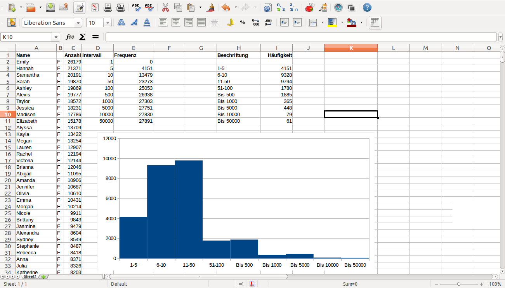

# Histogramm der Namenshäufigkeiten

## Ziele

* ein Histogramm erstellen
* Werte auszählen

## Aufgaben

Wir möchten herausbekommen, wie viele Namen 5-10 mal, 11-50 mal, 50-100 mal usw. vorkommen. Die grafische Darstellung davon nennt man ein **Histogramm**.

#### Check

Du brauchst eine geladene Tabelle wie aus der ersten Übung. Es genügen Spalten A-C. Speichere Dir die Tabelle als Sicherheitskopie ab, dann kannst Du die restlichen Spalten löschen.

### 1. Anzahlen als Liniendiagramm

Erstelle ein Liniendiagramm mit den Anzahlen in Spalte C.

#### Fragen

* Was kannst Du im Diagramm sehen?
* Was nicht?

### 2. Intervalle eintragen

Trage in die leere Spalte **D** untereinander die Intervallgrenzen ein, nach denen wir zählen werden:

    1
    10
    50
    100
    500
    1000
    5000
    10000

### 3. Intervalle auszählen

Wir brauchen nun eine zusätzliche Spalte **D**. Zunächst zählen wir, wie viele Anzahlen von Vornamen in Spalte C innerhalb der Intervalle sind. Trage in Spalte **E** ein:

    =FREQUENCY(C$1:C$3333, D1)

Kopiere die Formel in der Spalte nach unten.

### 4. das Histogramm darstellen

Stelle die Zahlen in Spalte F als Balkendiagramm dar.
Du kannst Dir eine Spalte mit Beschriftungen 5-10, 11-50 usw. zurechtlegen, damit das Histogramm leichter lesbar wird.

Setze *spacing* auf 0%.

#### Fragen

* Welche Schwächen hat die im Bild gezeigte Darstellung?
* Wie kannst Du diese beheben?

